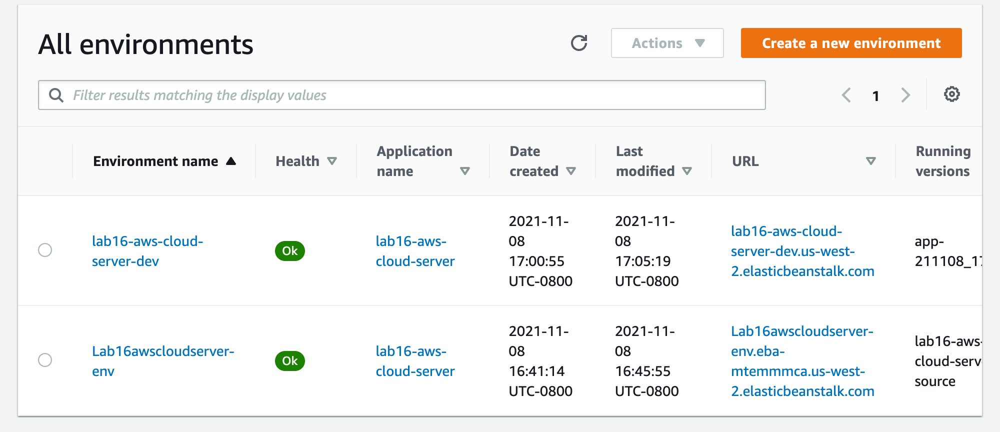

# aws-cloud-server

Created by Harvey Lucas

## Summary of Problem Domain

### Lab: Class 11

AWS: Cloud Servers

Deploy a simple Node.js server to EC2, using Elastic Beanstalk

### Task 1

- Create a new environment, using Elastic Beanstalk from the AWS Control Panel (GUI)
- Manually deploy your application to this environment by uploading a .zip file

GUI Deployment URL: http://lab16awscloudserver-env.eba-mtemmmca.us-west-2.elasticbeanstalk.com/

### Task 2

- Using the same server, create a new environment using Elastic Beanstalk from your terminal
- Manually deploy your application to this environment by using eb deploy

CLI Deployment URL: http://lab16-aws-cloud-server-dev.us-west-2.elasticbeanstalk.com/

## Visual

